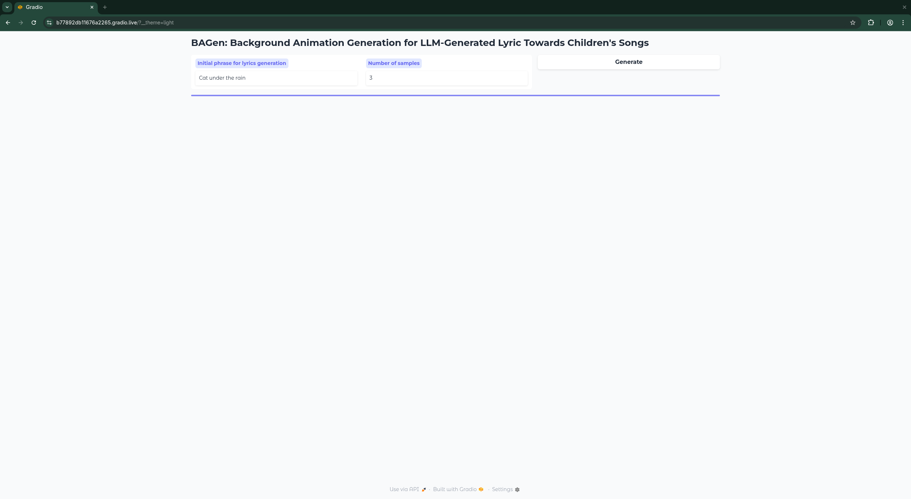
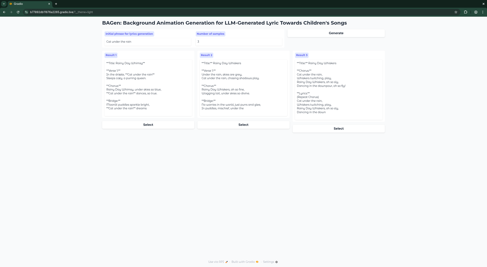
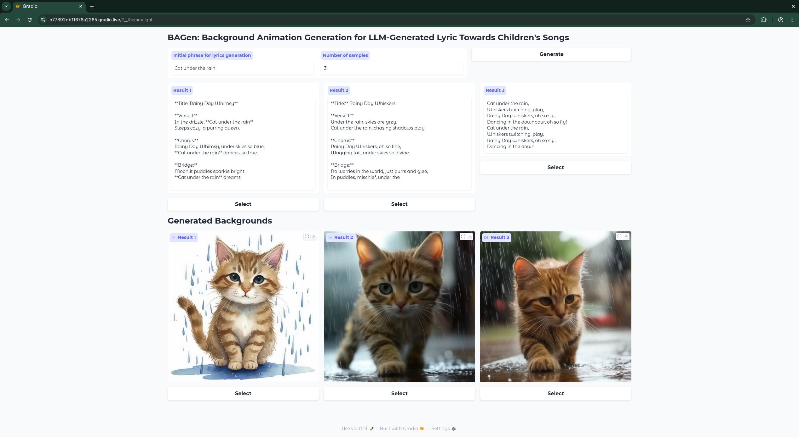
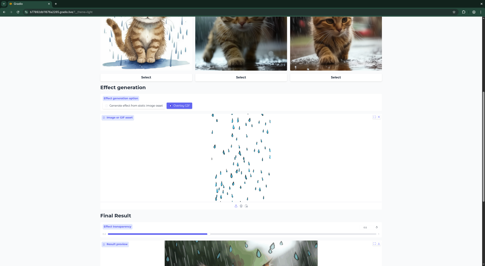
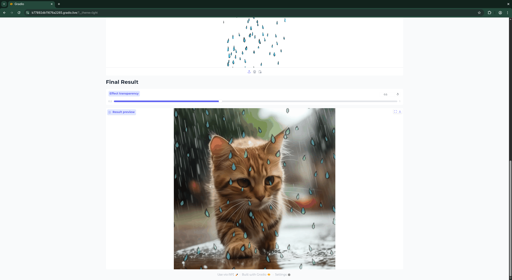

# BAGen: Background Animation Generation for LLM-Generated Lyric Towards Children's Songs
This project offers a powerful tool for generating animated content, featuring both a graphical user interface (GUI) and a command-line interface (CLI). It leverages advanced models for background generation and animation, providing flexible and impressive results.

### Features

* **GUI Version:** An intuitive interface for easy content generation.
* **CLI Version:** Programmatic control for automation and scripting.
* **Flexible Animation Modes:** Choose between GIF and direct animation output.
* **Customizable Background Generation:** Utilizes Cascade SD for rich, detailed backgrounds.

---

### Setup and Installation

To get started with this project, follow these steps:

1.  **Clone the Repository:**
    ```bash
    git clone https://github.com/KhrTim/BAGen.git
    cd BAGen
    ```

2.  **Create and Activate Conda Environment:**
    ```bash
    conda env create -n BAGEN -f environment.yml
    conda activate BAGEN
    ```

3.  **Initialize Submodules:**
    ```bash
    git submodule update --init
    ```

---

### Demo


*Example output: Generated background animation for children's songs*

#### GUI Workflow

The following screenshots show the step-by-step GUI workflow:

| Step 1: Interface | Step 2: Input | Step 3: Processing | Step 4: Progress | Step 5: Result |
|------------------|---------------|-------------------|------------------|----------------|
|  |  |  |  |  |

**[📹 Watch the complete workflow in action](assets/demo/screencast.gif)**

---

### Running the Application

#### GUI Version

To launch the graphical user interface, simply run:

```bash
python app.py
```

#### CLI Version

The CLI offers more direct control and can be used for scripting. Here's how to use it:

```bash
# Example CLI Usage:
python full_pipeline.py gif "a serene landscape with a flowing river"
python full_pipeline.py direct "a futuristic city at sunset"

```
